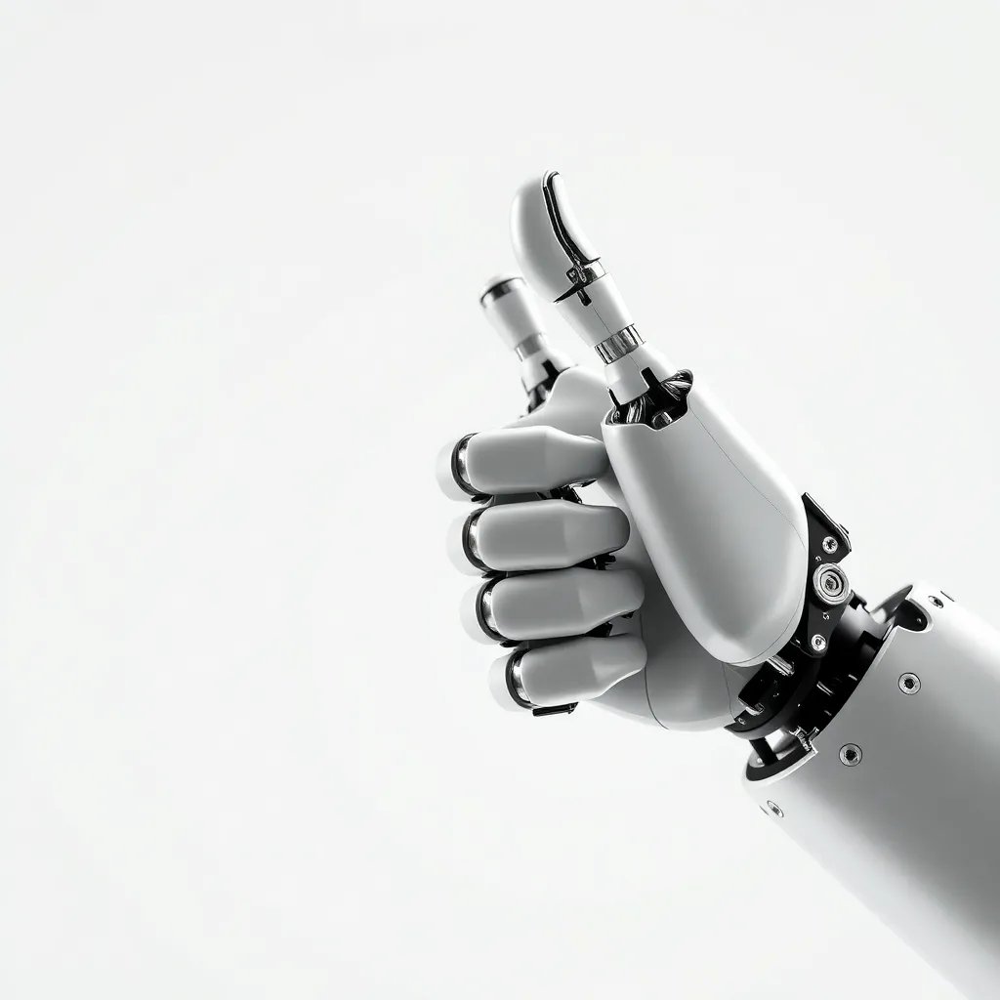

If you haven't checked out [Replicate](https://replicate.com) yet, you're missing out on one of the most developer-friendly ways to run AI models. It's like having a massive arcade of AI models at your fingertips, and you only pay for what you play.

## What Makes Replicate Rad?

Replicate takes the pain out of running AI models. No GPU provisioning, no Docker nightmares, no dependency hell. You just call an API and get results. It's the kind of developer experience that makes you want to high-five your computer.

Here's why I keep coming back:

- **Zero infrastructure** - No servers to manage, no GPUs to provision
- **Pay-per-use** - Only pay for the compute time you actually use
- **Massive model library** - Thousands of open-source models ready to run
- **Simple API** - A few lines of code and you're generating images, audio, or video

## Image Generation with Flux

The header image for this post? Generated with [Flux Schnell](https://replicate.com/black-forest-labs/flux-schnell) in under a second. That 80s BMX RAD movie vibe was exactly what I asked for:

```
1980s BMX movie poster style, bold retro typography spelling RAD 
with neon glow effects, BMX bike doing radical tricks, synthwave 
sunset colors orange pink purple, chrome metallic text effects, 
dramatic lighting, VHS aesthetic, action sports poster art
```

Flux is my go-to for quick image generation. It's fast, produces high-quality results, and handles text in images surprisingly well.

### Other Image Models Worth Checking Out

- **[SDXL](https://replicate.com/stability-ai/sdxl)** - The classic Stable Diffusion XL, great for general-purpose image generation
- **[Flux Pro](https://replicate.com/black-forest-labs/flux-pro)** - Higher quality version of Flux for production use
- **[Recraft V3](https://replicate.com/recraft-ai/recraft-v3)** - Excellent for design assets and illustrations
- **[Ideogram](https://replicate.com/ideogram-ai/ideogram-v2-turbo)** - Another strong option for text-in-image generation

## Beyond Images

Replicate isn't just for images. The model library covers basically every AI use case:

### Audio & Music

- **[MusicGen](https://replicate.com/meta/musicgen)** - Generate music from text descriptions
- **[Bark](https://replicate.com/suno-ai/bark)** - Text-to-speech with incredible expressiveness
- **[Whisper](https://replicate.com/openai/whisper)** - OpenAI's speech recognition model

### Video

- **[Stable Video Diffusion](https://replicate.com/stability-ai/stable-video-diffusion)** - Turn images into short videos
- **[Mochi](https://replicate.com/genmo/mochi-1-preview)** - Text-to-video generation
- **[LTX Video](https://replicate.com/lightricks/ltx-video)** - Fast video generation

### Language & Vision

- **[LLaVA](https://replicate.com/yorickvp/llava-13b)** - Vision-language model for understanding images
- **[Llama](https://replicate.com/meta/meta-llama-3-70b-instruct)** - Meta's open-source LLM
- **[CodeLlama](https://replicate.com/meta/codellama-70b-instruct)** - Code-focused language model

## The Developer Experience

What I really appreciate is how consistent the API is across models. Whether you're generating an image or transcribing audio, the pattern is the same:

```javascript
import Replicate from "replicate";

const replicate = new Replicate();

const output = await replicate.run("black-forest-labs/flux-schnell", {
  input: {
    prompt: "a robot hand giving a thumbs up",
    aspect_ratio: "1:1"
  }
});

console.log(output);
```



That's it. No complex setup, no model weights to download, no CUDA version conflicts. Just results.

## Pricing That Makes Sense

Replicate's pricing model is refreshingly simple - you pay for compute time. Flux Schnell runs at about $0.003 per image. That means you can generate hundreds of images for a dollar while experimenting.

For production use, they offer reserved capacity and volume discounts. But for tinkering, learning, and building prototypes, the pay-as-you-go model is perfect.

## Get Started

If you want to try Replicate:

1. Sign up at [replicate.com](https://replicate.com)
2. Grab your API token from the dashboard
3. Install the SDK: `npm install replicate`
4. Start building!

The [documentation](https://replicate.com/docs) is excellent, and browsing the [model explore page](https://replicate.com/explore) is genuinely fun - there's always some wild new model to try.

## Wrapping Up

Replicate has become an essential tool in my AI toolkit. It lets me focus on building cool stuff instead of managing infrastructure. Whether you're prototyping an idea, building a product, or just having fun with AI, it's worth checking out.

Now if you'll excuse me, I have more 80s BMX poster art to generate.

---

*All images in this post were generated using Replicate. The header used [Flux Schnell](https://replicate.com/black-forest-labs/flux-schnell) with the prompt described above.*
